# A/B Test MVP – High-Level Design

## 1. Architecture Overview

```mermaid
flowchart TD
  %% --- LAYERS ---
  subgraph L1["Frontend (Next.js + tRPC React Query)"]
    UI["💻 Tabs: Experiments / Variants / Assignments"]
    Hooks["🪝 tRPC Client Hooks<br/>(useQuery, useMutation)"]
  end

  subgraph L2["Backend (tRPC Server + Prisma)"]
    RouterRoot["⚙️ appRouter (root.ts)"]
    RouterExp["🧪 experimentsRouter"]
    RouterVar["🎚️ variantsRouter"]
    RouterAssign["🎯 assignmentsRouter"]
    Prisma["🗄️ Prisma Client<br/>src/server/db.ts"]
  end

  subgraph L3["Database Layer"]
    DB["🪶 SQLite Database<br/>(prisma/schema.prisma)"]
    Tables["📊 Tables:<br/>Experiment • Variant • Assignment"]
  end

  %% --- FLOW ---
  UI -->|"User action / form submit"| Hooks
  Hooks -->|"tRPC procedure call"| RouterRoot
  RouterRoot --> RouterExp
  RouterRoot --> RouterVar
  RouterRoot --> RouterAssign

  RouterExp -->|"CRUD queries"| Prisma
  RouterVar -->|"Upsert / list"| Prisma
  RouterAssign -->|"Assign / get"| Prisma
  Prisma -->|"SQL read/write"| DB
  DB --> Tables

  %% --- RETURN FLOW ---
  Tables --> DB
  DB -->|"Query results"| Prisma
  Prisma -->|"Typed data"| RouterRoot
  RouterRoot -->|"Response (superjson)"| Hooks
  Hooks -->|"React state update"| UI
```

- **Next.js App Router** renders three tabs (Experiments, Variants, Assignments). Client components call tRPC hooks.
- **tRPC React Query client** handles caching, optimistic updates (experiment delete) and hydration.
- **tRPC server router** exposes domain-specific routers: `experiments`, `variants`, `assignments`.
- **Prisma** models enforce referential integrity and sticky assignments in SQLite.

## 2. Data Model

| Model | Fields | Notes |
| ----- | ------ | ----- |
| `Experiment` | `id`, `name`, `status`, `strategy`, `startAt`, `endAt`, timestamps | `name` is snake_case + unique; `_count.variants` used for table display. |
| `Variant` | `id`, `experimentId`, `key`, `weight`, timestamps | `key` unique per experiment; weights 0‑100 (managed via slider UI). |
| `Assignment` | `id`, `experimentId`, `variantId`, `userId`, `createdAt` | Unique `(experimentId,userId)` guarantees sticky assignment. |

All relations cascade on delete so removing an experiment clears variants and assignments automatically.

## 3. tRPC Procedures

### Experiments Router
| Procedure | Input | Behaviour |
| --- | --- | --- |
| `list` | `{ search?: string; status?: ExperimentStatus[] }` | Returns experiments ordered by `createdAt desc`, including `_count.variants`. |
| `create` | `ExperimentInput` | Validates snake_case name, strategy, status, datetimes. |
| `update` | `{ id, …ExperimentInput }` | Same validation plus chronological date guard. |
| `delete` | `{ id: cuid }` | Deletes experiment (variants/assignments cascade). |

### Variants Router
| Procedure | Input | Behaviour |
| --- | --- | --- |
| `list` | `{ experimentId }` | All variants for experiment (ordered). Optional input returns empty list. |
| `upsertMany` | `{ experimentId, variants[] }` | Validates ≥2 variants, unique uppercase keys, weight bounds. Performs transactional delete/update/create diff. |

### Assignments Router
| Procedure | Input | Behaviour |
| --- | --- | --- |
| `list` | `{ experimentId }?` | Current assignments per experiment with variant data. |
| `get` | `{ experimentId, userId }` | Returns existing sticky assignment or `null`. |
| `assign` | `{ experimentId, userId }` | Checks for existing assignment; otherwise picks variant weighted-randomly, creates row, returns variant. Invalidates `get`/`list`. |

## 4. Assignment Strategy

- **Sticky persistence**: `Assignment` table contains one row per `(experimentId, userId)`. `assign` first attempts `findUnique`.
- **Variant selection**: when no assignment exists, available variants’ weights are clamped to ≥0 and summed. We use `crypto.randomInt(totalWeight)` to choose a variant proportionally; if total weight ≤0 we fallback to uniform selection.
## 5. UI Responsibilities

| Tab         | Key Components                                                  | Notes                                                                                 |
|-------------|-----------------------------------------------------------------|---------------------------------------------------------------------------------------|
| Experiments | `ExperimentsClient`, `ExperimentFormDialog`, `ExperimentsTable` | Search + status filter, variant count column, dialog-based create/edit.               |
| Variants    | `VariantsClient`, `useVariants`, `VariantsTable`                | Select experiment, manage variants with slider-based weights, validation before save. |
| Assignments | `AssignmentsClient`                                             | Form to assign user, card showing current sticky assignment.                          |

All tabs share the same dark gradient background and shadcn/ui components to match UX guidance.

## 6. Validation & Error Handling

- **Zod**: enforces snake_case experiment names, status enums, date chronology, variant key uniqueness, weight ranges, user ID length.
- **tRPC error formatter**: surfaces validation errors in client forms.
- **Optimistic updates**: experiment delete uses React Query’s `onMutate/onError/onSettled`.
- **Client-side guards**: variant editor ensures ≥2 variants before save; assignments form requires 3+ char user IDs.